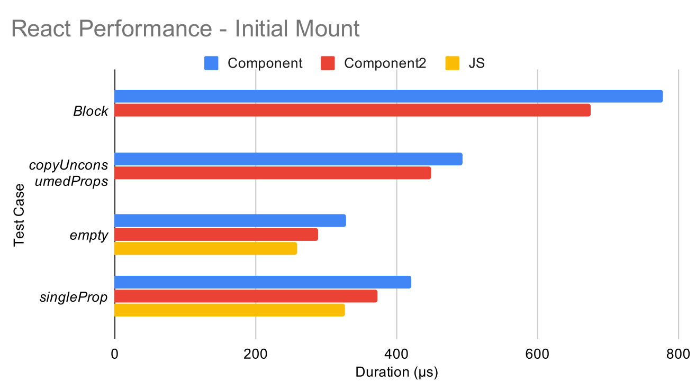
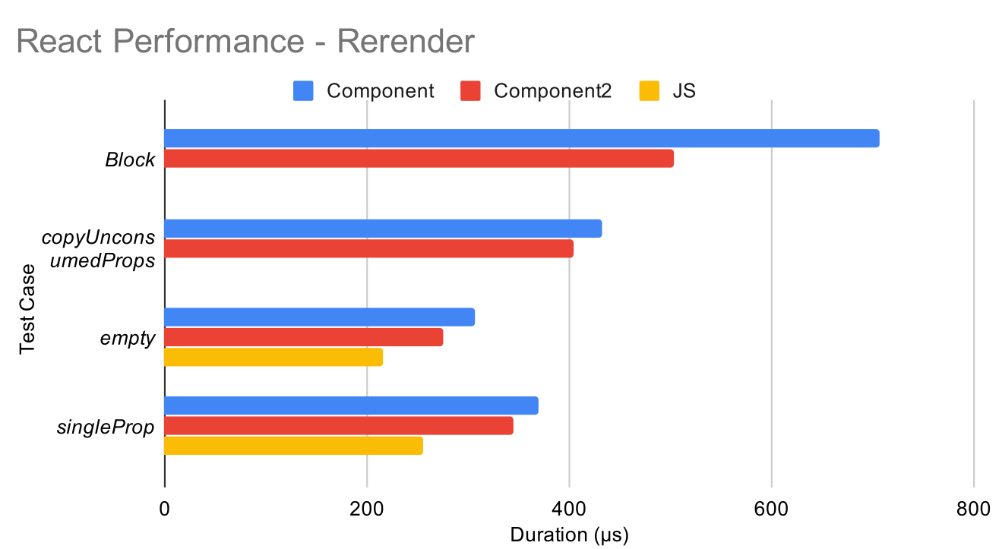

# UiComponent2 Transition Notes
> A document to explain the new features and breakages when converting components from Component / UiComponent to 
Component2 / UiComponent2.
---
* __[Overview](#whats-new-in-component2)__
* __[Why a new base class?](#why-a-new-base-class)__
* __[New Features, Improvements, and Breakages](#new-features-improvements-and-breakages)__
    * [Small Perf Improvements](#small-perf-improvements)
    * [JS-Backed Maps](#js-backed-maps)
    * [Lifecycle Method Changes](#lifecycle-method-changes)
    * [Other Method Changes](#other-method-changes)
    * [PropTypes](#prop-validation-goes-through-proptypes)
    * [ErrorBoundary Component Added](#errorboundary-component-added)
    * [Other Breaking Changes](#other-breakages-we-made-while-we-had-the-opportunity)
* __[Updating](#updating)__
## Overview
In `react` 5.1.0 and `over_react` 3.1.0, `Component` and `UiComponent` were deprecated in favor of new versions of the API: `Component2` and `UiComponent2`.

#### tl;dr

- Pros: slightly faster, improved dev experience, easier to maintain, easier integration with JS libs
- Cons: breaks a few advanced component APIs that will require conversion, some of which will be automated with codemod

Migration to UiComponent2 is opt-in and can happen at any time until the next major release of OverReact. A 
[codemod](#updating) is available to handle the simpler cases, but it will take manual intervention to update some 
components.

## Why a new base class?
- It's not possible for us to automatically support both unsafe and safe lifecycle methods without a resolved AST in 
the over_react builder, which would increase build times dramatically.
- We needed some small breakages to support
  - JS-backed maps
  - New lifecycle methods
  - Injection of Dart->JS interop pieces into component instance (initComponentInternal) needed to change (this was 
 publicly accessible, but was not used anywhere)
  - componentDidUpdate, which now takes an additional `snapshot` argument
  - Make assignment of `props`/`state` to arbitrary Maps impossible (was not advised, but possible)
  - Prop validation, which had to be reimplemented since it relied on unsafe component lifecycle transitions

## New Features, Improvements, and Breakages

### Small Perf Improvements
Component2 provides a small performance boost over Component, as a result of JS-backed maps and other optimizations.

#### Data
- For a component that reads a single prop and renders a simple div, upgrading it to UiComponent2 results in:
  - initial renders that are 11% faster
  - rerenders that are 6.5% faster
- Special case: for a component that has simple lifecycles, but heavy prop reads, upgrading it to 
UiComponent2 results in:
  - initial renders that are 12% faster
  - rerenders that are 28% faster
 

  
### JS-Backed Maps
Props/state key-value pairs are stored directly on JS objects, instead of within Dart Maps which are opaque to React. Results in:

- Modest overall rendering perf improvements due to decreased copying, garbage creation, and Dart map overhead
- Props/state show up in the React DevTools, and primitive values (strings, numbers, booleans) can be edited live
- Easier to interop with JS libraries that manipulate props, like react-redux
- Easier to maintain react-dart/over_react interop and add new features

### Lifecycle Method Changes

- Drops support for unsafe lifecycle methods:
  - componentWillMount
  - componentWillReceiveProps
  - componentWillUpdate
- Adds support for new, safe lifecycle methods:
  - getDerivedStateFromProps
  - getSnapshotBeforeUpdate
  - componentDidCatch / getDerivedStateFromError (adds support for [error boundaries](https://reactjs.org/docs/error-boundaries.html))
- componentDidUpdate now receives a `snapshot` argument, which is the return value of getSnapshotBeforeUpdate.
  
See the [React docs](https://reactjs.org/docs/react-component.html#the-component-lifecycle) for information on why the old methods are unsafe and how to transition to the new ones. This 
information is also available and linked to within the lifecycle methods' doc comments.

### Other Method Changes
- `getDefaultProps` is now `get defaultProps`
- `getInitialState` is now `get initialState`
- `..addProps(copyUnconsumedProps())` is now `..modifyProps(addUnconsumedProps)`. The same is true with `DomProps`, 
the usage being `..modifyProps(addUnconsumedDomProps)`. Using `addUnconsumedProps` was shown to render 8% faster than
 `copyUnconsumedProps`.

### Prop validation via PropTypes
- Aligns with ReactJS implementation
- Shows "component stack" that helps determine where the error came from
- React automatically de-duplicates the same warnings
- __No longer throws, but warns__. When upgrading to `Component2`, prop validation will no longer stop the component 
from rendering. If tests exist verifying that prop validation occurs, these will likely need to change. There are new 
`PropType` testing utils within [over_react_test](https://github.com/Workiva/over_react_test).

### ErrorBoundary Component Added

With the ability to utilize componentDidCatch / getDerivedStateFromError comes the ability to use [error boundaries](https://reactjs.org/docs/error-boundaries.html).
A component (called ErrorBoundary) is present within OverReact and can be used to wrap a component tree to prevent it 
from unmounting when an error is thrown. Alternatively, a custom error boundary can be created by utilizing the 
[ErrorBoundaryMixin](../lib/src/component/error_boundary_mixins.dart).

Usage of the default error boundary can be found in the Component1 examples (within web), and usage of a custom error 
boundary can be found in the Component2 examples.

### Other breakages we made while we had the opportunity
- Split `Component.setState` into two methods, so that each has strong typing 
  - setState's first argument is now typed as `Map`, not `dynamic`
  - A new `setStateWithUpdater` is added, which accepts transactional updater functions
- Remove `bind`—a non-standard API leftover from early react-dart code—to reduce perf overhead
- Re-implement prop validation and remove support for `validateProps`
- Drop support for legacy context APIs

## Updating

To update your repository to use UiComponent2 / Component2, you can use 
[over_react_codemod](https://github.com/Workiva/over_react_codemod)'s `component2_upgrade` executable to make it 
easier. This codemod goes through the repository and updates components as necessary. While the codemod will handle 
many basic updates, it will still need to be supplemented with some manual checks and refactoring. 
To run the codemod, simply follow the directions within [the executable](https://github.com/Workiva/over_react_codemod/blob/master/lib/src/executables/component2_upgrade.dart#L30)
while inside your repository.

#### Flags

When running the command `pub global run over_react_codemod:component2_upgrade` to update your components, there are 
two flags that can be used:
- `--no-partial-upgades`: asserts that the component is able to fully update to `Component2` 
before making changes. If that assertion is false, then no changes will occur to that component. The most common cases 
that would cause a component _not_ to be updated because of this flag are:
  - __Use of the deprecated lifecycle methods `componentWillReceiveProps` or `componentWillUpdate`.__ Because the 
  transition from those lifecycle methods to a new one is highly dependent upon the reason behind using them, the 
  codemod does not attempt to update them.
  - __Has a `with` clause.__ Because a mixin adds uncertainty, this flag will not update cases where mixins are 
  implemented.
  - __Extends from an unknown class__. Because the highest level parent in an inheritance hierarchy must be 
  `Component2` for the children to be, the usage of this flag enforces that the component to be updated must extend 
  from a known base class (UiComponent, UiStatefulComponent, UiFluxComponent, FluxUiStatefulComponent or their 
  Component2 variants).
- `--upgrade-abstract-components`: determines whether or not the codemod should upgrade classes annotated as 
`Abstract`. If the flag is present, the codemod __will__ update abstract components. 
