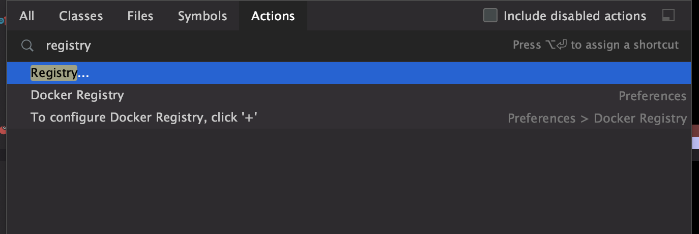
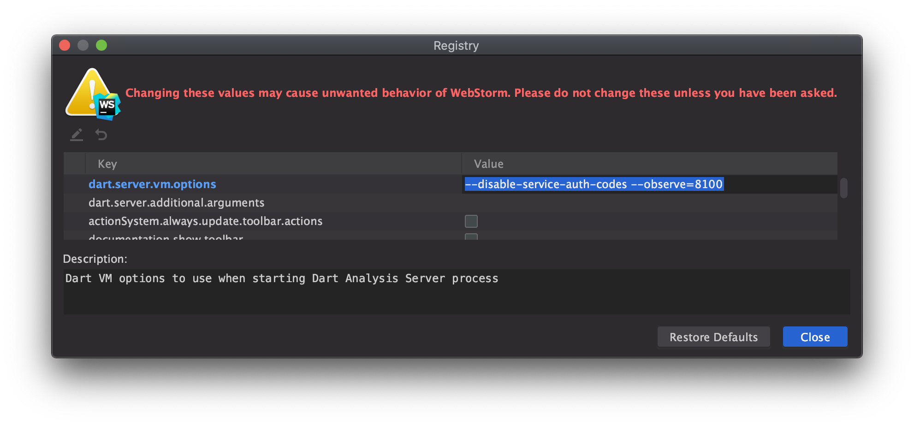
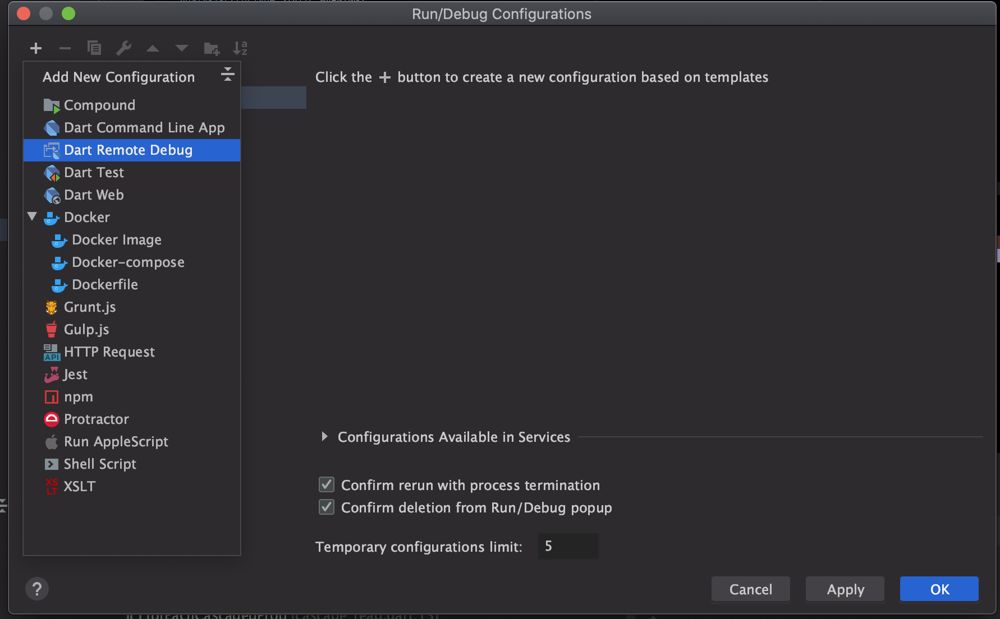
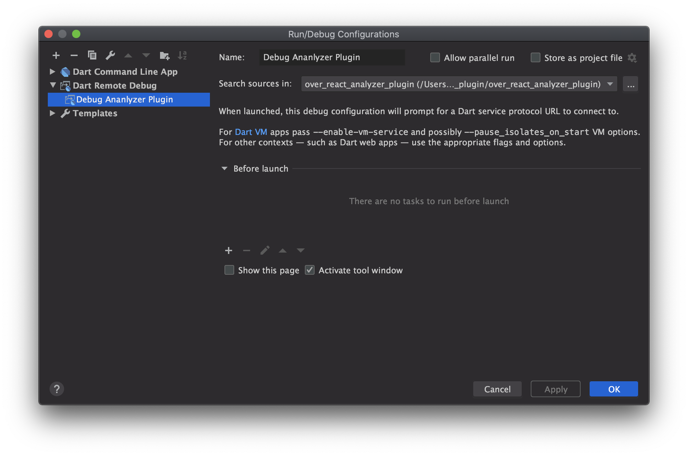
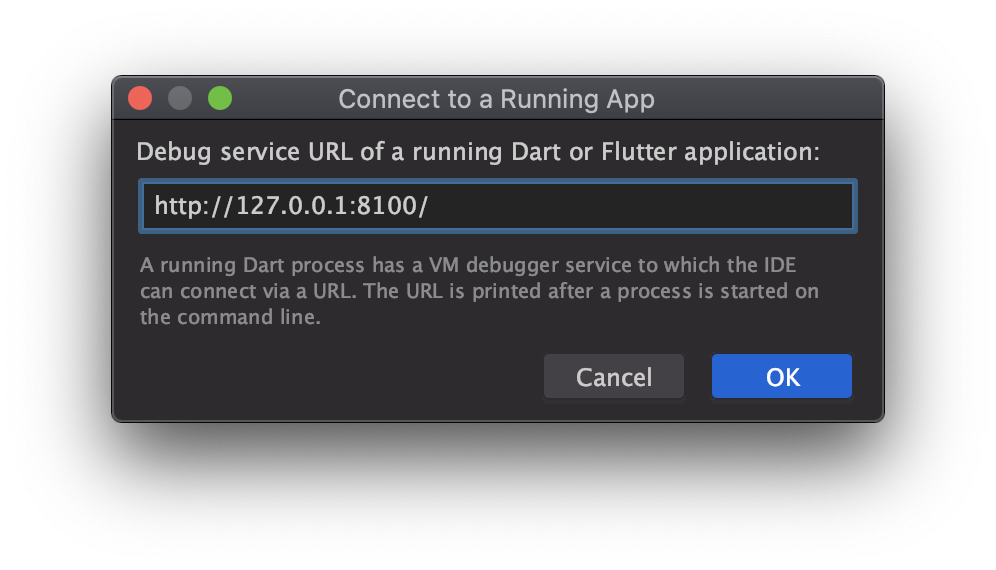

# OverReact Analyzer Plugin

> An experimental OverReact [Dart analyzer plugin][analyzer_plugin].
>
> - [Notes/planning document](https://docs.google.com/document/d/1xHjC66eUvX_SSBRXw-sVOxRzvenWfOpu8m1BQI6GmqQ/edit#)
> - Slack channel: [#react-analyzer-plugin](https://slack.com/app_redirect?channel=react-analyzer-plugin)

Though unsupported in Dart 1, this can still be used with Dart 1 packages by switching your IDE to use the Dart 2 analysis server.

## Try it in your package!
1. Add the following dependency to your app's pubspec.yaml:
    ```yaml
    dev_dependencies:
      over_react_analyzer_plugin_host:
        git:
          url: git@github.com:greglittlefield-wf/git_playground.git
          ref: over_react_analyzer_plugin/master
          path: plugin_hosts/git
    ```
1. Run `pub get`
    - __Note:__ if using Dart 1, you'll have to use [`pub2get`](pub2get) in order to pull in this project due to the use of the Git dependency's `path` config, which was introduced in the Dart 2 solver.
    
      If you don't, you'll get errors that look like:
      > Could not find a file named "pubspec.yaml" in git@&#8203;github.com:greglittlefield-wf/git_playground.git 892bd7360d91f99c220e367a4e5c0b4af6f62389.
1. [Enable and use the plugin](#enable-and-use-the-plugin)

_If you wish to develop the plugin locally, see [this section](#local-development)_.
   
## Repo Structure

See the [analyzer_plugin package structure documentation][analyzer_plugin_package_structure] for terminology and more info.

- _over_react_analyzer_plugin_ - the plugin package itself
- _playground_ - a "target" package that consumes the plugin, useful for manually testing plugin during development 
- _plugin_hosts_ - plugin "host" packages that allow easily pulling in the plugin to other target packages during development
    - local - contains a loader that has a `path` dependency on _over_react_analyzer_plugin_.
        This points to a local copy of the plugin, will be used more often during development. 
    - git - contains a loader that has a `git` dependency on _over_react_analyzer_plugin_
        This can be used to easily pull in certain Git revisions of the plugin.
        
## Local Development

See [analyzer_plugin's tutorial][analyzer_plugin_tutorial] on building a plugin for general information on developing a Dart analyzer plugin.

The development cycle for working on the plugin looks like:
1. **First things first:** Update the absolute path dependency in the pubspec.yaml under _plugin_hosts/git/tools/analyzer_plugin_ to point to your local clone of this repo.
1. Make changes to the plugin within the _over_react_analyzer_plugin_ directory
1. In the _playground_ directory or in [another package you've pulled the plugin into](#pulling-in-a-local-version-of-the-plugin), restart the Analysis Server
1. Wait for the Analysis Server to boot up, analyze, and run your updated plugin code    

## Pulling the plugin into another package

### Pulling in a local version of the plugin 
To pull a local copy of this plugin into another target package (the package you want to use the plugin on):
1. Clone this repo 
1. **First things first:** Update the absolute path dependency in the pubspec.yaml under _plugin_hosts/git/tools/analyzer_plugin_ to point to your local clone of this repo.
1. Within the target package's pubspec.yaml, add a path dependency to repo's _plugin_hosts/path_ directory:
    ```yaml
    dev_dependencies:
      over_react_analyzer_plugin_host:
        path: /Users/me/workspaces/over_react_analyzer_plugin/plugin_hosts/path
    ```
1. Run `pub get`
1. [Enable and use the plugin](#enable-and-use-the-plugin)

### Pulling in a specific version of the plugin from a Git ref
To push up a branch containing plugin changes that can be easily consumed by other users:
1. Clone this repo 
1. Create a new branch, which will contain your plugin changes as well as changes to the Git plugin host package
   to point to the same branch, thus pulling in your changes.
1. In the Git host package's pubspec, located within _plugin_hosts/git/tools/analyzer_plugin_, 
   update the Git ref to point to your branch, and commit those changes.
   
   ```diff
    # If pulling in to another branch, update the ref here.
    git:
   -  url: git@github.com:greglittlefield-wf/git_playground.git
   -  ref: over_react_analyzer_plugin/master
   +  url: git@github.com:foo-barsons-wk/git_playground.git
   +  ref: over_react_analyzer_plugin/new-feature-x
      path: plugin_hosts/git
   ```

To pull that branch into the target package (the package you want to use the plugin on):   
1. Within the target package's pubspec.yaml, add a Git dependency to this repo's _plugin_hosts/path_ directory:
    ```yaml
    dev_dependencies:
      over_react_analyzer_plugin_host:
        git:
          url: git@github.com:foo-barsons-wk/git_playground.git
          ref: over_react_analyzer_plugin/new-feature-x
          path: plugin_hosts/git
    ```
1. Run `pub get`
    - __Note:__ if using Dart 1, you'll have to use [`pub2get`](pub2get) in order to pull in this project due to the use of the Git dependency's `path` config, which was introduced in the Dart 2 solver.
    
      If you don't, you'll get errors that look like:
      > Could not find a file named "pubspec.yaml" in git@&#8203;github.com:greglittlefield-wf/git_playground.git 892bd7360d91f99c220e367a4e5c0b4af6f62389.
1. [Enable and use the plugin](#enable-and-use-the-plugin)

### Enable and use the plugin
Once you've depended on the over_react_analyzer_plugin_host host package, to start using it:

1. Add the following to your package's analysis_options.yaml:
    ```yaml
    analyzer:
      plugins:
        over_react_analyzer_plugin_host
    plugins:
      over_react_analyzer_plugin_host:
        enabled: true
    ```
1. (If this is a Dart 1 package) Switch to the Dart 2 analyzer if you haven't already done so
1. Restart the analysis server in your IDE

After these steps, you can start using this plugin!


### Debugging the Plugin
The dev experience when working on this plugin isn't ideal (See the analyzer_plugin debugging docs [for more information](https://github.com/dart-lang/sdk/blob/master/pkg/analyzer_plugin/doc/tutorial/debugging.md) for more info), but it is possible to get set up to debug and see logs from the plugin.

These instructions are currently for JetBrains IDEs (IntelliJ, WebStorm, etc.) only.

1. Open the "Registry" using the command palette (<kbd>Command</kbd>+<kbd>Shift</kbd>+<kbd>A</kbd>

    
    
2. Edit the `dart.server.vm.options` configuration and set the value to `--disable-service-auth-codes --observe=8100`

     
    
    - `--observe=8100` - Allow access to the Observatory on port 8100 (can be any port of your choosing) so that our debugger can connect to it.
    - `--disable-service-auth-codes` - Disable authentication on the Observatory, since the JetBrains plugin swallows the log that outputs the auth code.
    
            
6. In the project you're running your plugin on, restart the Dart Analysis Server so that it launches with these flags. You may have to close other Dart projects first to ensure other analysis servers don't take the reserved port
    _TODO we need more investigation around whether this is necessary; if it is, we may want to integrate `--write-service-info` into the instructions._

4. In the over_react_analyzer_plugin project, create a new Run Configuration using the "Dart Remote Debug" template
    
     
    
     
    
5. Ensure the "Search sources in" section is pointing to the plugin package directory and save it.
    
     
    
7. Run your newly created configuration by selecting it and clicking the "Debug" button
    
    
    
8. When prompted, enter in `http://127.0.0.1:8100`, removing any parts of the URL dealing with auth codes.
    
    

8. In the debugger tab that was opened, verify that the debugger connected.
    
    
    
9. Start debugging! You can set breakpoints, view logs, and do everything else you'd normally use the debugger for.


[analyzer_plugin]: https://github.com/dart-lang/sdk/tree/master/pkg/analyzer_plugin
[analyzer_plugin_tutorial]: https://github.com/dart-lang/sdk/blob/master/pkg/analyzer_plugin/doc/tutorial/tutorial.md
[analyzer_plugin_package_structure]: https://github.com/dart-lang/sdk/blob/master/pkg/analyzer_plugin/doc/tutorial/package_structure.md
