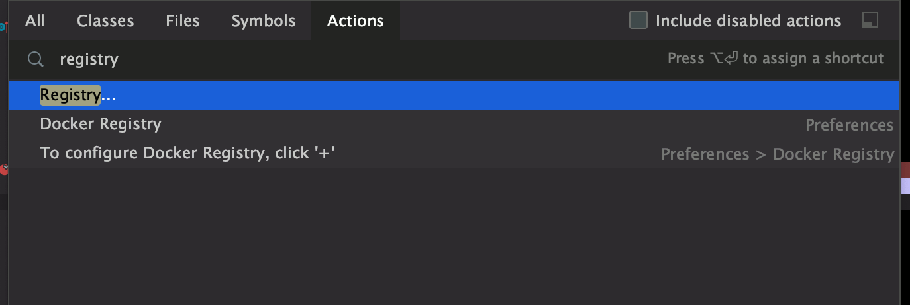
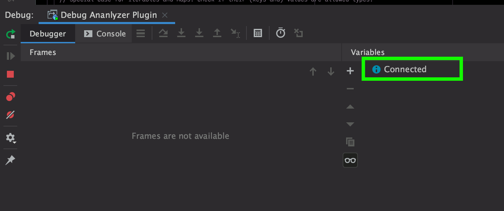

# OverReact Analyzer Plugin

> A [Dart analyzer plugin][analyzer_plugin] for OverReact
>
> - [Notes/planning document](https://docs.google.com/document/d/1xHjC66eUvX_SSBRXw-sVOxRzvenWfOpu8m1BQI6GmqQ/edit#)
> - Slack channel: [#react-analyzer-plugin](https://slack.com/app_redirect?channel=react-analyzer-plugin)


## Try it in your package!
1. Add over_react to your pubspec.yaml

    __If you wish to develop the plugin locally, see [this section](#local-development).__
    
1. Enable the plugin in your analysis_options.yaml:
    ```yaml
    analyzer:
      plugins:
        over_react
    ```
1. Restart the Dart Analysis Server in your IDE
   
## Repo Structure

See the [analyzer_plugin package structure documentation][analyzer_plugin_package_structure] for terminology and more info.

- _over_react_: the "host" package
    - _over_react_analyzer_plugin_ (`over_react/tools/analyzer_plugin`) - the "boostrap" and "plugin" packages, merged
        - _playground_ - (`over_react/tools/analyzer_plugin/playground`) - a "target" package that consumes the plugin, useful for manually testing plugin during development 
        
## Local Development

See [analyzer_plugin's tutorial][analyzer_plugin_tutorial] on building a plugin for general information on developing a Dart analyzer plugin.

### Setup

**Before you do anything:** run 
```sh
dart tool/link_plugin.dart
```

Normally, the Dart Analysis Server does a one-time copy of plugin code into the Dart Analysis Server state folder (usually `~/.dartServer/.plugin_manager`), and never updates for plugins derived from path dependencies (TODO make dart-lang issue for this). 

This means, normally, ___any changes you make to the plugin will not be reflected___.

This script sets up a symlink to point to the original plugin directory (replacing any copy if it exists), so that changes are always reflected.  

### Development cycle
1. Make changes to the plugin within the _over_react_analyzer_plugin_ directory
1. In the _playground_ directory or in [another package you've pulled the plugin into](#pulling-in-a-local-version-of-the-plugin), restart the Analysis Server
1. Wait for the Analysis Server to boot up, analyze, and run your updated plugin code    

### Debugging the Plugin
The dev experience when working on this plugin isn't ideal (See the analyzer_plugin debugging docs [for more information](https://github.com/dart-lang/sdk/blob/master/pkg/analyzer_plugin/doc/tutorial/debugging.md) for more info), but it is possible to get set up to debug and see logs from the plugin.

These instructions are currently for JetBrains IDEs (IntelliJ, WebStorm, etc.) only.

1. Open the "Registry" using the command palette (<kbd>Command</kbd>+<kbd>Shift</kbd>+<kbd>A</kbd>

    
    
2. Edit the `dart.server.vm.options` configuration and set the value to `--disable-service-auth-codes --observe=8100`

     
    
    - `--observe=8100` - Allow access to the Observatory on port 8100 (can be any port of your choosing) so that our debugger can connect to it.
    - `--disable-service-auth-codes` - Disable authentication on the Observatory, since the JetBrains plugin swallows the log that outputs the auth code.
    
            
6. In the project you're running your plugin on, restart the Dart Analysis Server so that it launches with these flags. You may have to close other Dart projects first to ensure other analysis servers don't take the reserved port
    _TODO we need more investigation around whether this is necessary; if it is, we may want to integrate `--write-service-info` into the instructions._

4. In the over_react_analyzer_plugin project, create a new Run Configuration using the "Dart Remote Debug" template
    
     
    
     
    
5. Ensure the "Search sources in" section is pointing to the plugin package directory and save it.
    
     
    
7. Run your newly created configuration by selecting it and clicking the "Debug" button
    
    
    
8. When prompted, enter in `http://127.0.0.1:8100`, removing any parts of the URL dealing with auth codes.
    
    

8. In the debugger tab that was opened, verify that the debugger connected.
    
    
    
9. Start debugging! You can set breakpoints, view logs, and do everything else you'd normally use the debugger for.


[analyzer_plugin]: https://github.com/dart-lang/sdk/tree/master/pkg/analyzer_plugin
[analyzer_plugin_tutorial]: https://github.com/dart-lang/sdk/blob/master/pkg/analyzer_plugin/doc/tutorial/tutorial.md
[analyzer_plugin_package_structure]: https://github.com/dart-lang/sdk/blob/master/pkg/analyzer_plugin/doc/tutorial/package_structure.md
